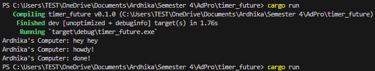
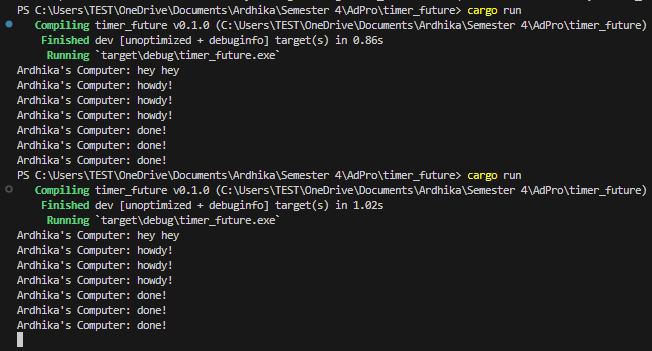

# 📝Tutorial & Exercise 10📝

**Student Details :**

|  Attribute    | Information                |
|---------------|----------------------------|
| Name          | Ardhika Satria Narendra    |
| Student ID    | 2206821866                 |
| Class         | Advanced Programming KKI   |

---

Module 10: High Level Networking

## Questions and Answers

### -> Reflection 

#### 1.2: Understanding how it works

When I spawn a task using the provided spawner, it initiates an asynchronous process. The task is programmed to print "Ardhika's Computer: howdy!" and then waits for 2 seconds before printing "Ardhika's Computer: done!". In this experiment, I have inserted a synchronous println!("Ardhika's Computer: hey hey"); statement right before the asynchronous spawner call in the main function.

As a result, when the program runs, the synchronous println! statement executes immediately, outputting "Ardhika's Computer: hey hey" directly to the console. This is because synchronous code executes in the order it is written and completes before moving on. On the other hand, the asynchronous task that was spawned right after waits for its turn on the executor to start its execution. Once it begins, there is a 2-second pause implemented in the code, following which it prints "Ardhika's Computer: howdy!" and after another 2 seconds, concludes with "Ardhika's Computer: done!".

#### 1.3: Multiple Spawn and removing drop

In Experiment 1.3 titled "Multiple Spawn and Removing Drop", the focus was on understanding the behavior of spawning multiple asynchronous tasks in Rust and observing the effects of the `drop()` function on these tasks. Initially, a synchronous `println!("Ardhika's Computer: hey hey");` statement was executed, which outputted immediately due to its synchronous nature. Following this, three asynchronous tasks were spawned, each configured to print "Ardhika's Computer: howdy!", pause for 2 seconds, and then print "Ardhika's Computer: done!". These tasks started nearly simultaneously but did not block each other or the main program flow, demonstrating Rust's non-blocking concurrency model. The tasks printed "howdy!" one after another, each followed by "done!" after their respective delays.

The role of the `drop()` function was particularly noteworthy. When included, `drop()` effectively managed the lifecycle of the asynchronous tasks, ensuring that the program terminated cleanly after all tasks completed their execution. This was evidenced by the orderly output and shutdown of the task executor. However, omitting the `drop()` function resulted in the tasks' executor continuing indefinitely, requiring a manual termination via Ctrl+C. This highlighted the `drop()` function's importance in controlling the execution flow in Rust's asynchronous programming environment, preventing potential runaway processes and ensuring resources are properly freed after task completion. This experiment not only clarified the execution patterns of synchronous versus asynchronous code but also underscored the necessity of proper task management in concurrent programming.

---

